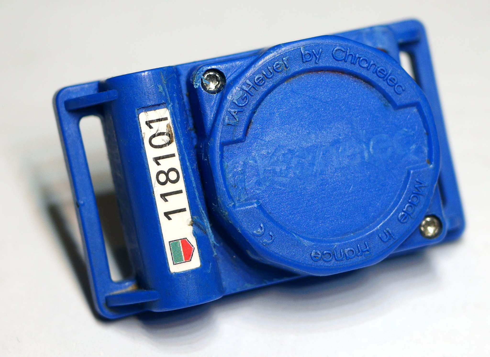

# rc-transponder

RC Transponder Documentation

The Tag Heuer/Chronelec RC transponder is a
discontinued LF/HF magnetic induction type
identifier for sports timing applications. 

This repository contains information on the
transponder hardware as well as tools for
updating the firmware.

## Contents

   - [hardware](hardware/) : RC hardware reference
   - [firmware](firmware/) : Firmware information and analysis
   - [programmer](programmer/) : Firmware re-programmer and drill template
   - [scripts](scripts/) : Shell and python scripts
   - [altfw](altfw/) : Alternative firmware

## Overview

Based around the PIC16F639 Microcontroller with
Low-Frequency Analog Front-End, the RC transponder
works like a Passive Keyless Entry (PKE) device. 
It receives activation messages on 125kHz
and then responds with a numeric ID by repeating
differential pulse position encoded strings on 3.28MHz
for a short while.

Both LF and HF circuits are magnetically communicated
with a compatible Chronelec Protime decoder and loop.

