# Hardware

## Circuit Analysis

RC Transponder circuitry is mounted on a small PCB 
under potting compound:

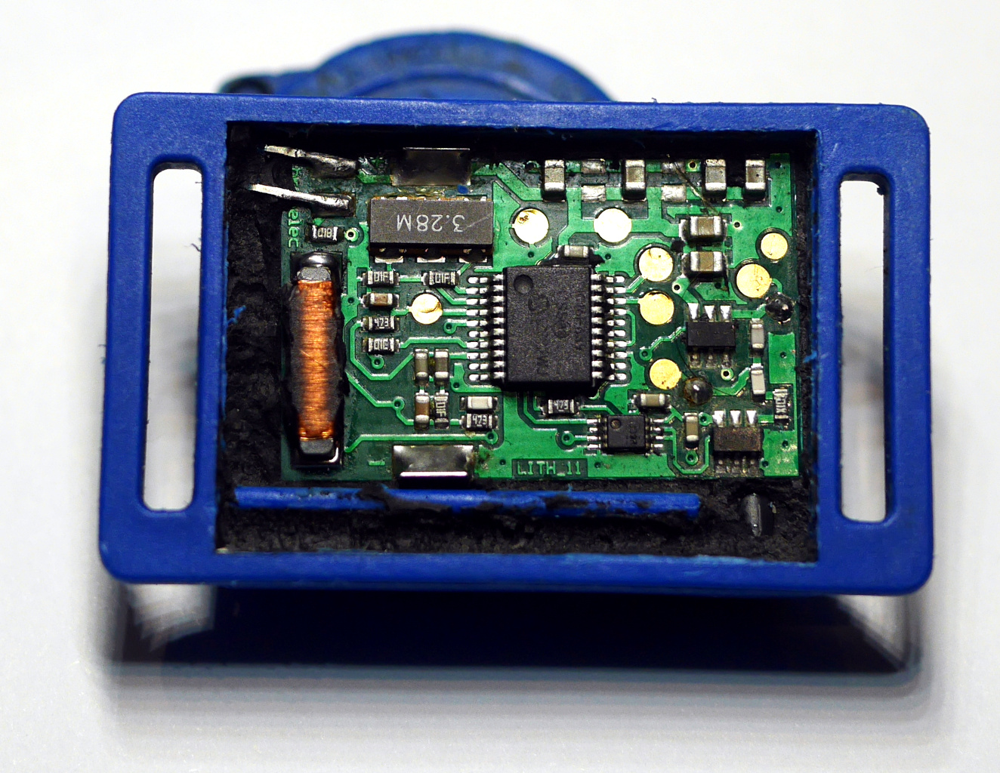

LF activation signals are received on 125kHz coil L1 by 
the integrated AFE in U1 (PIC16F639). 

Transponder ID is transmitted by 3.28MHz transmit coil L2
attached to the back side of the PCB:

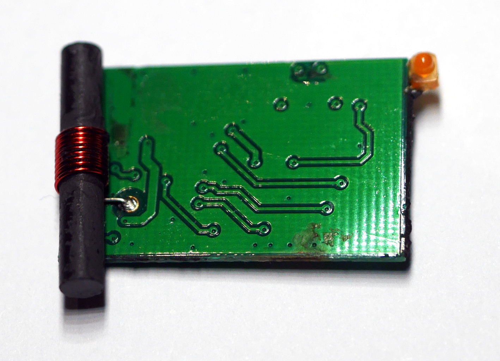

Driver ICs U3/U4 output the CPU clock (CCLK), gated by
PORT C0 output (DAT) through a dual NAND gate (U2).

[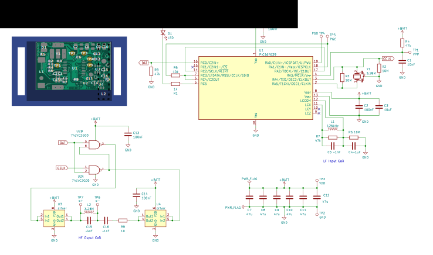](rctrans_schematic.pdf)

Notes:

   - Tuning capacitors C4/C5 and C15/C16 actual values are not known
   - Output driver IC U3/U4 parts are not known

## Signals

### LF Activation Signal

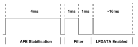

   - Carrier: 125kHz
   - Encoding: OOK
   - Period: ~20 ms

AFE is set up to enable LFDATA output after
reception of a 1ms on and 1ms off signal.
LFDATA is then passed until the expiry of the activity
timeout. Since the idle time between activation bursts
is just short of the typical AFE inactivity timer, LFDATA
will initially pass a short blip from the end of the
activation signal, and then the full message repeated
(see measurements below for an example).

### HF Transponder ID

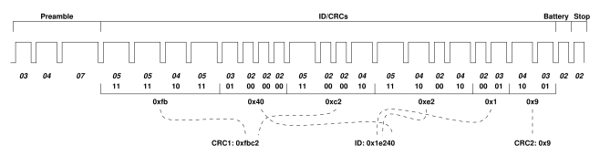

   - Carrier: 3.28MHz (CCLK)
   - Encoding: Differential PPM (2 bits per symbol)

Message Symbols:

   - '02' 0x0: 40 cycles / ~12 &#181;s 
   - '03' 0x1: 52 cycles / ~16 &#181;s
   - '04' 0x2: 64 cycles / ~20 &#181;s
   - '05' 0x3: 76 cycles / ~23 &#181;s
   - '07' n/a: 100 cycles / ~30 &#181;s (preamble)

Message Format:

   - Preamble (3 symbols): '03' '04' '07
   - ID & CRCs (20 symbols)
      - CRC1[15:8] (4 symbols) [*]
      - ID[7:0] (4 symbols)
      - CRC1[7:0] (4 symbols) [*]
      - ID[15:8] (4 symbols)
      - ID[19:16] (2 symbols)
      - CRC2 (2 symbols) [**]
   - Battery (1 symbol): '02'=OK | '05'=Low Battery
   - Stop (1 symbol): '02'

Notes:

   1. CRC1 is 16 bit
      [MCRF4XX](https://reveng.sourceforge.io/crc-catalogue/all.htm#crc.cat.crc-16-mcrf4xx)
      taken over the bytes of the transponder ID, big-endian. For example,
      transponder ID 123456 (0x1e240) has CRC1 = mcrf4xx(b'\x01\xe2\x40'):
      0xfbc2
   2. CRC2 is a 4 bit CRC with poly=0x1 over the 4 bit nibbles of
      transponder ID rearranged in order of transmission. For example,
      123456 (0x1e240) computes CRC-4 on the value 0x40e21: 0x9

## Measurements

### LF Input

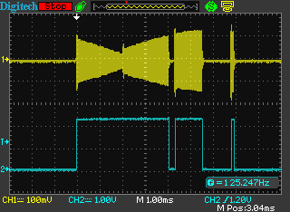
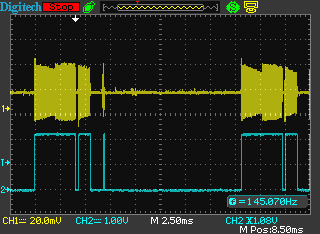

125kHz LF activation signal and AFE demodulated output on LFDATA. 

### HF Output

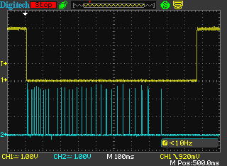

Example transmission (shown with RC5/LED output) - 0.8s total.

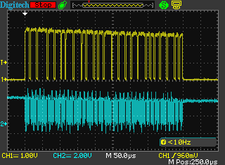
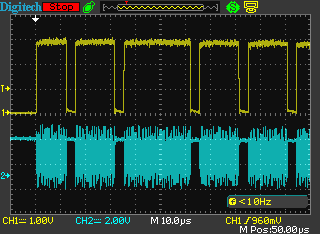

Token modulation, gaps positioned by delays encoded in ID block.

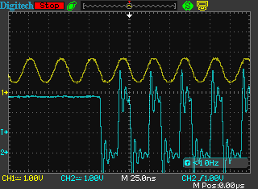
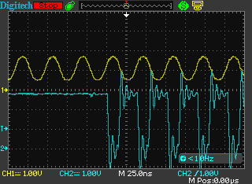
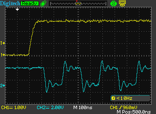

Gating CCLK/DAT signals through U2 into U3 and U4.

### Wakeup Reset

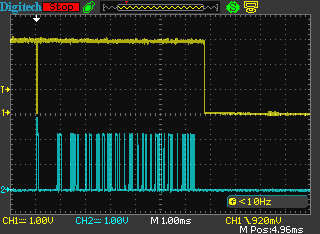
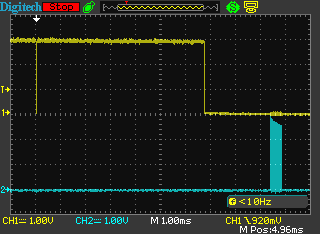

LED/LFDATA and LED/DAT on reception of valid activation. LFDATA
noise after trigger bit is due to AFE reconfiguration out of reset.
Transmit sequence begins about 7ms after wakeup, the first token
is sent about 2ms later.
