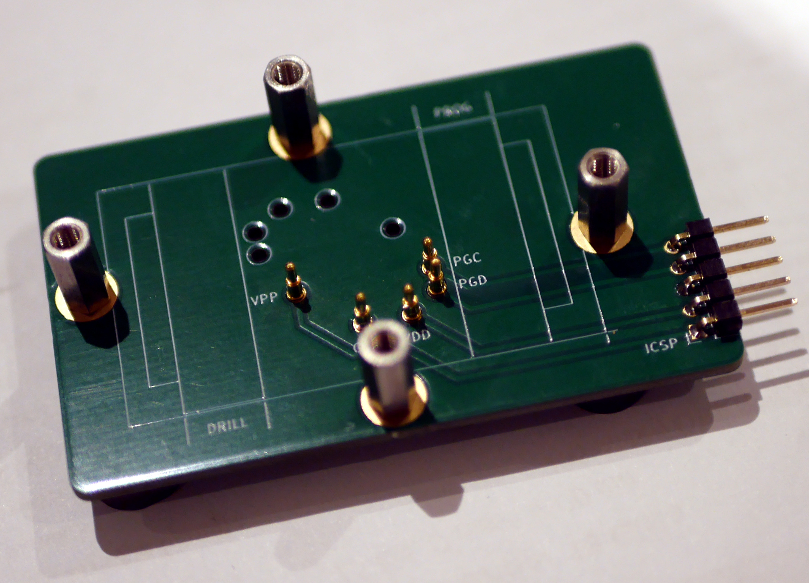
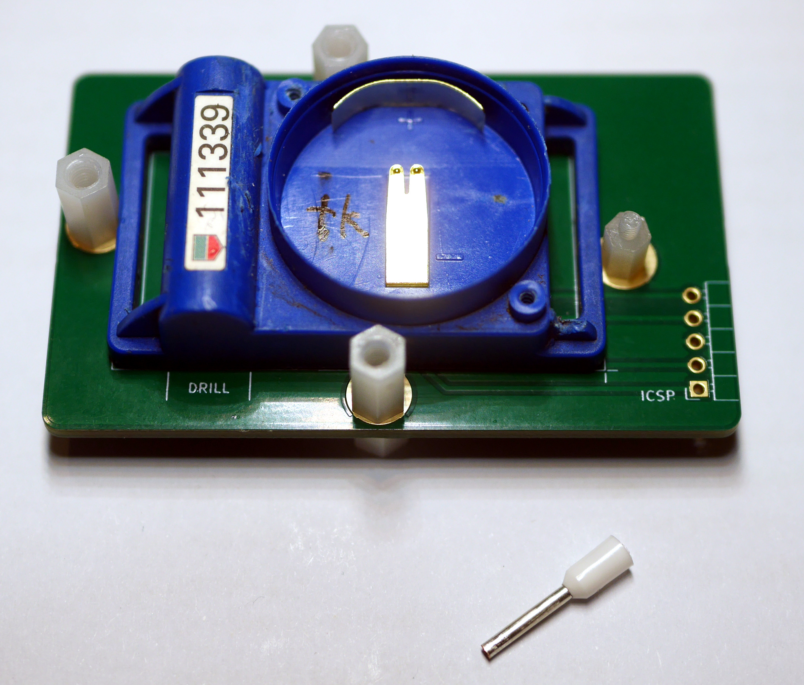
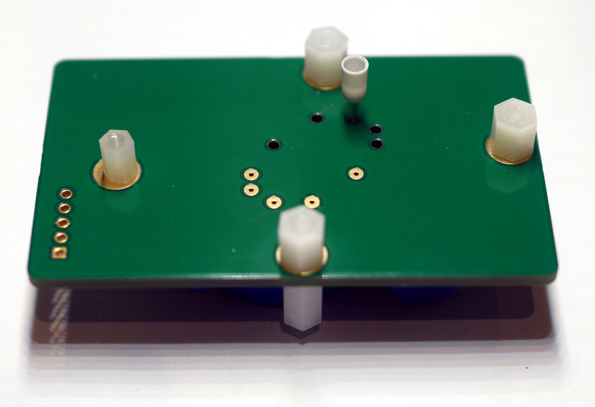
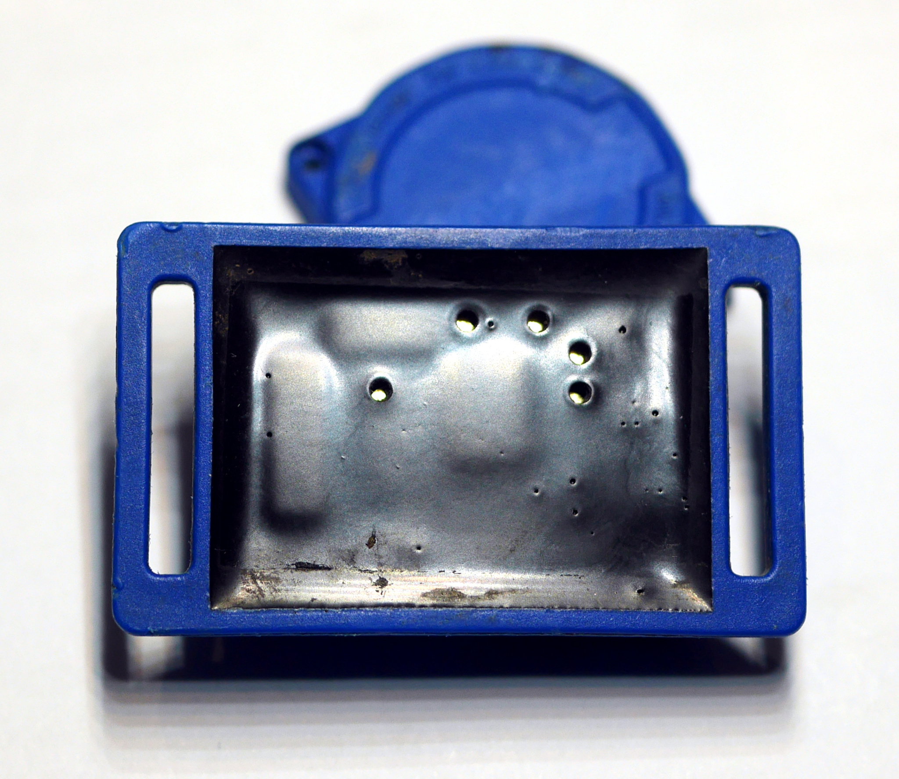
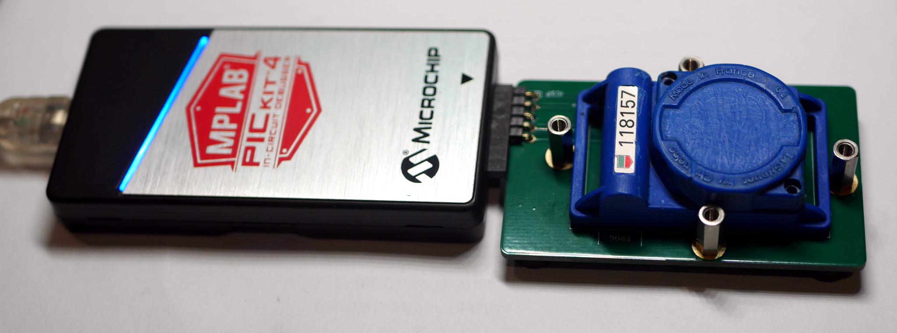

# Transponder Programmer

ICSP breakout board for re-programming RC transponders, KiCad 6
project.

## Transponder Preparation

Before re-programming, ICSP programming pads need to
be exposed by removing a small amount of the potting
compound with a white 1.5 mm diameter ferrule.

Use the "drill" template on a spare programmer PCB
to position the transponder and hold it square.
Then flip the assembly over and push ferrules into
the potting compound with a soldering iron
on low to medium heat.

Allow ferrules to cool, then carefully remove from assembly
exposing the programming pads.

After programming, pads can be left open for indoor use, or
filled with silicone for outdoor use.

## Programming

Place transponder carefully over programming pins
and then depress against pcb.

Run ipecmd or rcpatch script to update transponder as required.
If ipecmd fails with a connection error, check pad holes are
clear and aligned properly with programming pins. Gentle
rotation of the transponder while depressing it against the pcb
may help slightly misaligned pads make contact. Pad holes can be
enlarged with a red 2.0 mm diameter ferrule to help correct
misalignment.
